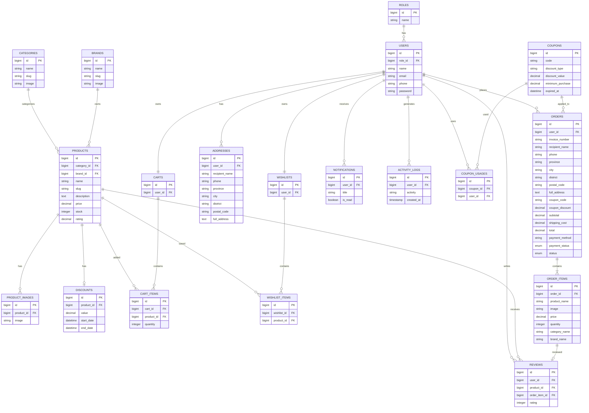

# Entity Relationship Diagram (ERD)

## E-Commerce Platform

Dokumen ini berisi Entity Relationship Diagram (ERD) dalam format
Mermaid.

## Catatan

- Role → Users = 1:N
- Category → Products = 1:N
- Brand → Products = 1:N
- Product → Product Images = 1:N
- Product → Reviews = 1:N
- User → Orders = 1:N
- User → Addresses = 1:N
- User → Notifications = 1:N
- Order → Order Items = 1:N
- Order Item → Review = 1:0..1
- Address SnapShot Order
- Product, Category, Brand Snapshot Order Item

